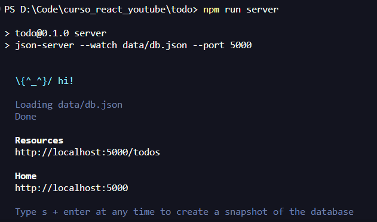
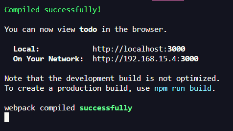
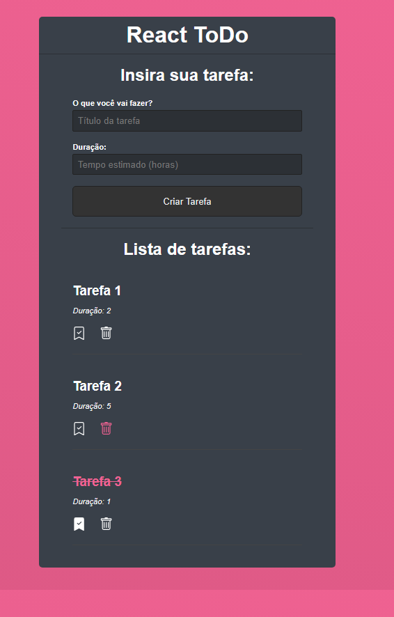

# **Projeto ToDo List**  
Lista de tarefas com React.
______________________

# Como inicializar:
Após clonar o repositório, use npm install para instalar as dependências.

É necessário rodar o server db.json usando o comando: *npm run server*.

Caso não funcione, tente instalar manualmente, usando: *npm install json-server --save-dev*

Quando visualizar a imagem abaixo, saberá que o server está pronto.

Abra outro terminal para iniciar o arquivo usando o comando: *npm start*

Caso não funcione, tente instalar manualmente, usando: *npm install react-scripts --save*

Ao final do carregamento você verá a seguinte notificação:

E por fim, terá o app aberto e pronto para uso.

# Informações:

Esse projeto é um exercício de curso.

Obrigado!
